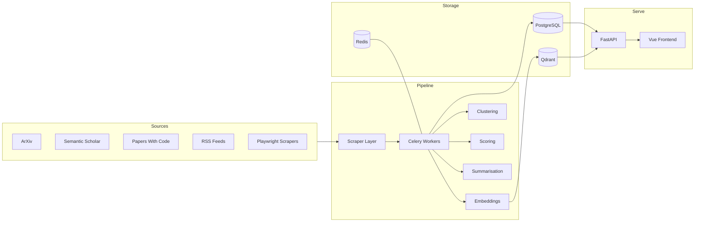
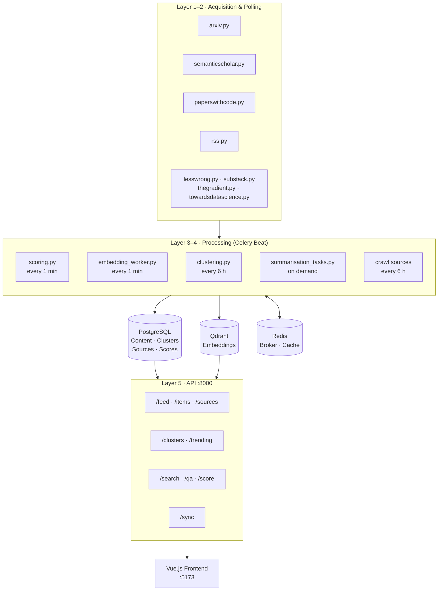
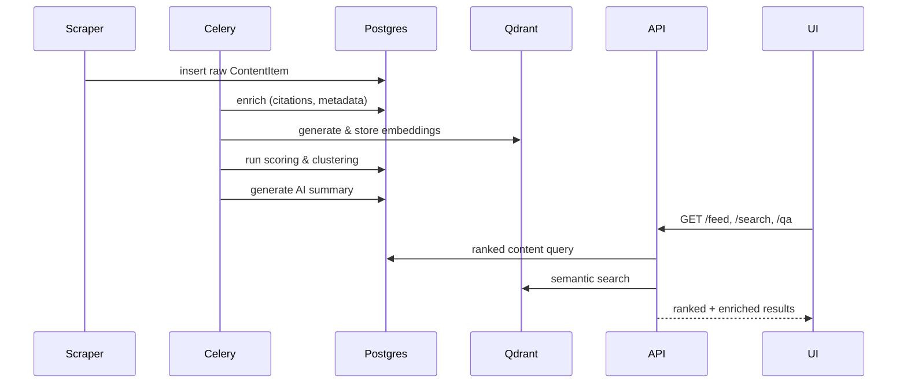
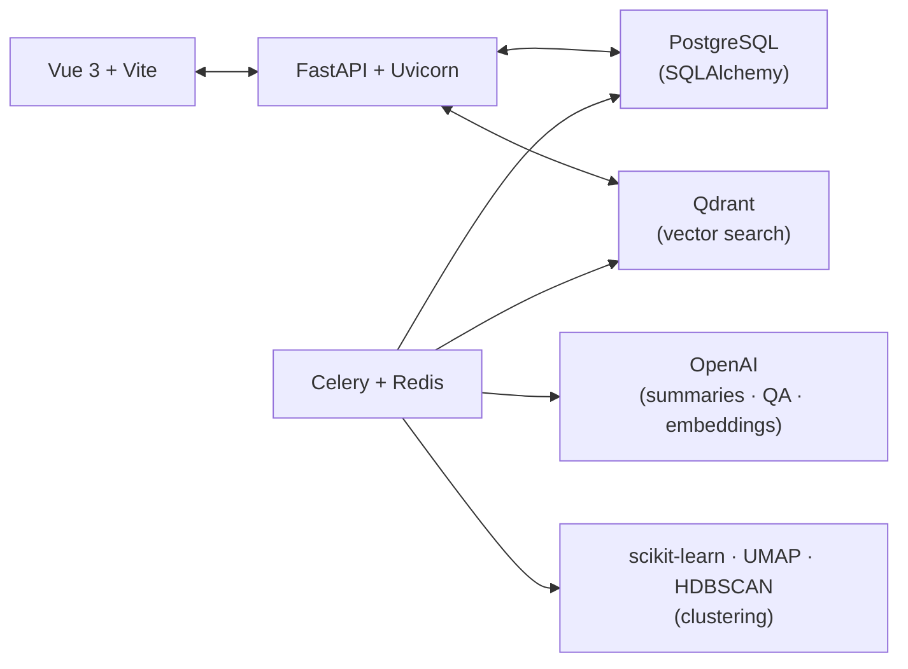

# Athena

> AI research intelligence — aggregate, process, rank, and explore content from across the AI landscape.



---

## Architecture



---

## Data Flow



---

## Quick Start

```bash
# 1. Python env
python3 -m venv venv && source venv/bin/activate
pip install -r requirements.txt && playwright install chromium
cp .env.example .env

# 2. Infrastructure
docker-compose up -d

# 3. Init & run
python3 scripts/setup_project.py   # schema + seed sources
python3 scripts/run_crawl.py       # first ingestion pass
celery -A athena.pipeline.tasks worker -l info --pool=threads
```

**Services**

| Service | Port |
|---------|------|
| FastAPI | 8000 |
| Vue Frontend | 5173 |
| PostgreSQL | 5432 |
| Redis | 6379 |
| Qdrant | 6333 |

---

## Stack



---

## Contributing

1. Fork → `git checkout -b feature/your-feature`
2. Commit → `git commit -m 'feat: description'`
3. PR → open against `main`

## License

MIT — see [LICENSE](LICENSE)
