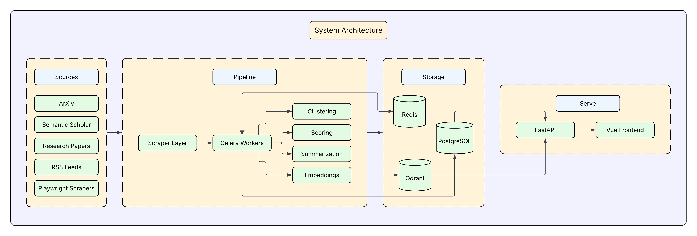

# Athena

> AI research intelligence — aggregate, score, cluster, summarise, and semantically search content from across the AI landscape.

[](https://github.com/Thisen-Ekanayake/Athena/actions/workflows/ci.yml)


Athena ingests papers and posts from ArXiv, Semantic Scholar, Papers With Code, RSS feeds, Substack, LessWrong and Playwright-scraped sites, enriches them through a Celery pipeline (embed → score → cluster → summarise), and serves ranked, semantically searchable results — with AI summaries, Q&A, topic clusters, and saved lists — to a React UI.



## Architecture

Data flows through five layers:

```
Scrapers → PostgreSQL → Celery workers (embed · score · cluster · summarise) → Qdrant → FastAPI → React UI
```

- **Scrapers** normalise raw content into PostgreSQL.
- **Celery workers** embed (OpenAI → Qdrant), score (6 weighted signals), cluster (UMAP + K-Means), and summarise (OpenAI).
- **FastAPI** serves the ranked feed, semantic search, clusters, Q&A, sources, and saved lists.
- **Frontend** — React 19 + TypeScript + Vite (Zustand, TanStack Query).

## Quick start

**Prerequisites:** Docker, and a `.env` file — copy `.env.example` and set at minimum `OPENAI_API_KEY`.

Athena ships two launchers:

### `./run_docker.sh` — full stack in Docker

Runs everything (Postgres, Redis, Qdrant, API, worker, frontend) via Docker Compose. Best for a production-like run.

```bash
cp .env.example .env          # then set OPENAI_API_KEY
./run_docker.sh               # start with pre-built GHCR images
./run_docker.sh --build       # build images locally instead
./run_docker.sh --logs        # follow worker logs after starting
./run_docker.sh --down        # stop & remove the stack
```

### `./run_native.sh` — native dev

Runs infra (Postgres, Redis, Qdrant) in Docker and the API, Celery worker, and frontend as local host processes — best for development (hot reload, fast iteration).

```bash
pip install -r requirements.txt && playwright install chromium   # one-time
cp .env.example .env
./run_native.sh               # start infra + app processes
./run_native.sh --stop        # stop everything
```

Needs `python3`, `uvicorn`, `celery`, `npm` on `PATH`; logs land in `${TMPDIR:-/tmp}/athena-local/`.

Once up — Frontend http://localhost:5173 · API http://localhost:8000 (`/docs`).

| Service | Port |
|---|---|
| Frontend (Vite) | 5173 |
| FastAPI | 8000 |
| PostgreSQL | 5432 |
| Redis | 6379 |
| Qdrant | 6333 |

## Configuration

All configuration is via environment variables (`athena/api/config.py`, Pydantic settings). Copy `.env.example` → `.env`. Minimum required: `OPENAI_API_KEY`. `DATABASE_URL`, `REDIS_URL`, and `QDRANT_URL` default to the Compose service addresses.

## Development

```bash
# Backend tests (SQLite — no live services required)
DATABASE_URL="sqlite:///test.db" REDIS_URL="redis://localhost:6379/0" \
  QDRANT_URL="http://localhost:6333" OPENAI_API_KEY="test-key" \
  pytest tests/test_scoring.py tests/test_preprocessing.py tests/test_connectors.py -v

# Lint (max line length 120)
flake8 . --max-line-length=120 --exclude=".venv,venv,frontend/node_modules"

# Frontend
cd frontend && npm install && npm run dev
```

CI (`ci.yml`) runs flake8 + pytest on every push to `main`/`develop`; CD (`cd.yml`) builds and publishes the API, worker, and frontend images to GHCR on push to `main`.

## Project layout

```
athena/
  scrapers/    source collectors (ArXiv, RSS, Substack, Playwright, …)
  database/    SQLAlchemy engine + all SQL operations
  pipeline/    Celery workers — embedding, scoring, clustering, summarisation
  api/         FastAPI app + routers
  core/        models & schemas
frontend/      React 19 + TypeScript + Vite
docker/        Dockerfiles + compose files
scripts/       setup, crawl, backfill, maintenance
```

## Contributing

Branch from `main` → [Conventional Commits](https://www.conventionalcommits.org/) (`feat:`, `fix:`, `chore:`) → open a PR against `main`. CI must pass.

## License

No license has been declared yet — all rights reserved by the author. Add a `LICENSE` file to set usage terms.
